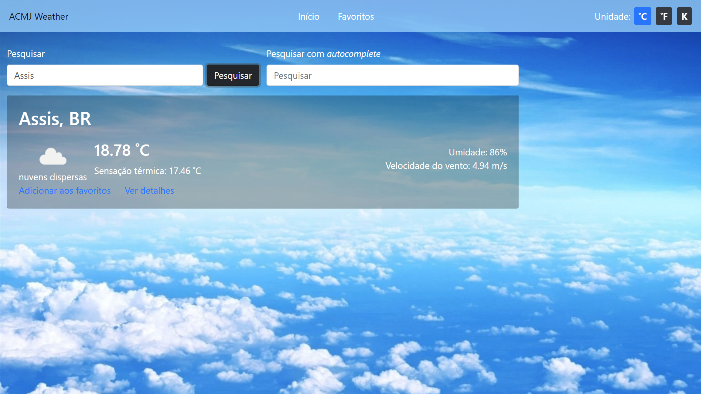

<h1>ACMJ Weather</h1> 

Este projeto foi feito usando Angular CLI versão 9.1.7.

API para consultar a previsão do tempo usando [OpenWeather](https://openweathermap.org/api).

Acesse: https://weather-forecast-api.vercel.app/

**Features:**

- Consultar a previsão do tempo pelo nome da cidade com e sem *autocomplete*.

- Alterar a escala de temperatura

- Kelvin (K).

- Celsius (C)

- Fahrenheit (F).

- Adicionar uma cidade como favorita.

- Consultar previsão para os próximos 7 dias:

  - Temperatura.

  - Velocidade do vento.

  - Horário do nascer do sol.

  - Horário do pôr do sol.

  - Umidade do ar.
